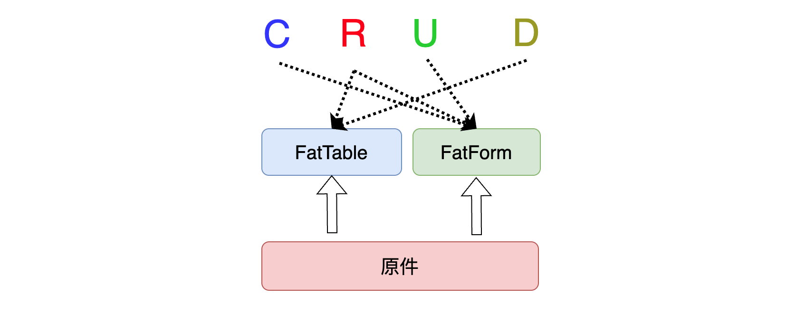

# 开始

<br>

`@wakeadmin/components` 是基于 Vue 和 `Element-UI`/`Element-plus` 的高级组件库。旨在解放管理后台端 CRUD 页面的前端生产力。

<br>

整体架构：


<br>

- `element-adapter`: 这里主要用于封装 element-ui/element-plus 之间的一些差异。 `@wakeadmin/components` 不会直接依赖 element-ui/element-plus, 而是使用 element-adapter 暴露的统一 API
- `@wakeadmin/h`/`@wakeadmin/demi`: 这是一个 JSX 库，屏蔽了 Vue 2/3 在视图渲染上的一些差异，从而让 `@wakeadmin/components` 兼容 Vue 2/3。

<br>
<br>
<br>

**主要内容：**



<br>

`@wakeadmin/components` 包含三大核心部件：

- `FatTable`: 用于常见的列表、表格查询页面
- `FatForm`: 用于常见的创建表单、更新表单、表单详情等页面
- `原件(Atomics)`: 原件是组成 FatTable、FatForm 的基本单位，为不同**数据类型**定义*编辑*和*预览*的视图。

<br>
<br>
<br>
<br>

## Prerequisites

`@wakeadmin/components` 支持 Vue 2/3:

- **Vue 2**: 要求 Vue 2.7+, element-ui 2.14+
- **Vue 3**: Vue 3.0+, element-plus 2.2+

<br>
<br>
<br>
<br>

## 安装

```shell
$ pnpm add @wakeadmin/components
```

<br>
<br>

**开发依赖**:

如果你想要使用 TSX/JSX 开发，并且获取到更好的 Typescript 类型检查，需要安装一下依赖:

<br>

```shell
$ pnpm add babel-preset-wakeadmin @wakeadmin/h @wakeadmin/demi @vue/runtime-dom -D
```

<br>

::: tip

推荐使用 Valor 插件，并禁用掉 Vetur 插件

:::

<br>
<br>
<br>

## JSX 支持

假设你的项目使用 Vue-CLI:

修改 `babel.config.js`

```js
module.exports = {
  // 关闭 vue 默认的 jsx 转换， 统一使用标准的 JSX
  presets: [['@vue/cli-plugin-babel/preset', { jsx: false }], 'babel-preset-wakeadmin'],
};
```

Typescript 配置:

```json{3,4,5}
{
  "compilerOptions": {
    "jsx": "preserve" /* Specify JSX code generation: 'preserve', 'react-native', 'react', 'react-jsx' or 'react-jsxdev'. */,
    "jsxImportSource": "@wakeadmin/h",
    "types": ["@wakeadmin/demi"]
  },
}

```

<br>
<br>

如果你要在 Vue SPA 中使用 TS + JSX， Eslint 可能会报错，你需要以下配置：

```js{4-10}
// 支持 .vue 文件中 包含 jsx
const ts = require('typescript');

const { ensureScriptKind } = ts;
ts.ensureScriptKind = function (fileName, ...args) {
  if (fileName.endsWith('.vue')) {
    return ts.ScriptKind.TSX;
  }
  return ensureScriptKind.call(this, fileName, ...args);
};

module.exports = {
  extends: ['wkts', 'wkvue', 'plugin:jest/recommended'],
  plugins: [],
  globals: {},
  rules: {},
  parser: 'vue-eslint-parser',
  parserOptions: {
    parser: '@typescript-eslint/parser',
    project: 'tsconfig.json',
    sourceType: 'module',
    ecmaVersion: 'latest',
    extraFileExtensions: ['.vue'],
  },
  env: {
    browser: true,
    es2020: true,
  },
  overrides: [
    {
      files: ['*.ts', '*.tsx'],
      rules: {},
      parser: '@typescript-eslint/parser',
      parserOptions: {
        warnOnUnsupportedTypeScriptVersion: true,
        ecmaVersion: 'latest',
        lib: ['esNext'],
        project: './tsconfig.json',
      },
    },
  ],
};
```

<br>
<br>
<br>

## 开启编程之旅

最后安装 Vue 插件:

```tsx
import Vue from 'vue';
import { plugin } from '@wakeadmin/components';

// vue 2.x 用法
Vue.use(plugin);
```

<br>
<br>

开发一个简单的表格：

```tsx
import { defineFatTable } from '@wakeadmin/components';

/**
 * 表格项类型
 */
export interface Item {
  id: number;
  name: string;
  createDate: number;
}

export const MyTable = defineFatTable<Item>(({ column }) => {
  return () => ({
    // 表格数据获取
    async request(params) {
      const { pagination, query } = params;

      const { data: list, total } = await getMyList({ ...query, ...pagination });

      return {
        total,
        list,
      };
    },
    // 删除操作
    async remove(list, ids) {
      await removeItem(ids);
    },
    // 表格列
    columns: [
      // queryable 标记为查询字段
      column({ prop: 'name', label: '名称', queryable: true }),
      column({ prop: 'createDate', valueType: 'date-range', label: '创建时间', queryable: true }),
      column({
        type: 'actions',
        actions: (table, row) => [{ name: '编辑' }, { name: '删除', onClick: () => table.remove(row) }],
      }),
    ],
  });
});
```
