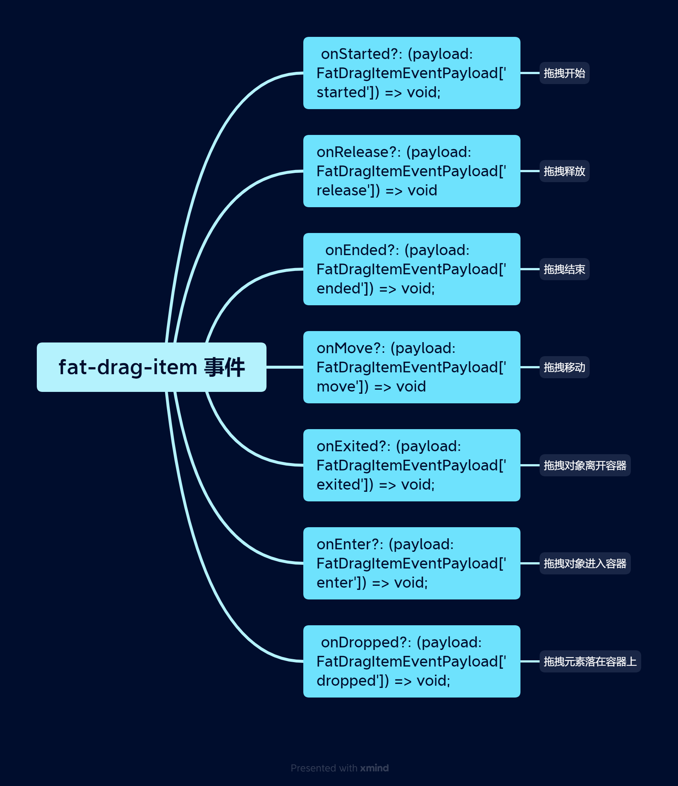
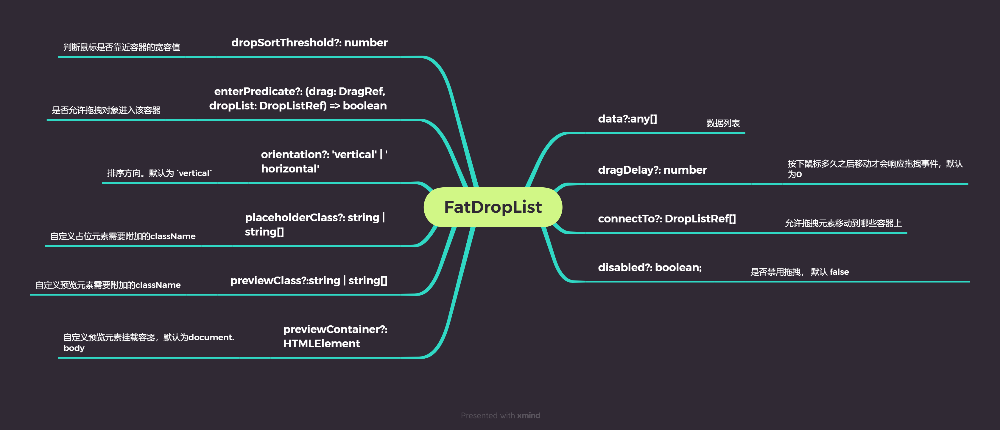

# Fat Drag Drop

`FatDragDrop` 用于处理拖拽操作。

 

[[toc]]

 
 
 

## 1. 创建一个自定义拖拽元素

 
 

<ClientOnly>
  
<BaseDrag />

</ClientOnly>

::: details 查看代码

<<< @/fat-drag-drop/demo/drag.vue

:::

 
 
 

## 2. 自定义触发元素

默认情况下，整个元素都是可以响应拖拽事件的，我们也支持通过特定元素来进行触发拖拽，比如我们只允许通过点击`🐇`触发拖拽

<ClientOnly>
  
<DragHandler />

</ClientOnly>

::: details 查看代码

<<< @/fat-drag-drop/demo/dragHandler.vue

:::

 
 
 

## 3. 限制拖拽范围

默认情况下，我们不会对拖拽元素进行任何限制。但是我们也提供一些`props`用来限制元素的移动

<ClientOnly>
  
<DragLimit />

</ClientOnly>

::: details 查看代码

<<< @/fat-drag-drop/demo/dragLimit.vue

:::

::: tip
`drag-boundary` 如果传入一个`string`的话，那么会调用`document.querySelector`去获取对应的元素，请确保该元素已经被添加到页面上。
当然，我们也可以直接传入一个`HTMLElement`元素给它
:::

 
 
 

## 4. 禁用拖拽

通过`disabled`来禁用拖拽

<ClientOnly>
  
<DragDisabled />

</ClientOnly>

::: details 查看代码

<<< @/fat-drag-drop/demo/dragDisabled.vue

:::

 
 
 

## 5. 拖拽延迟

在一些特殊场合，我们的宿主元素可能需要同时监听`click`事件，这个时候我们可以添加拖拽延迟来防止元素错误的响应拖拽事件。比如下面的例子，我们需要等待鼠标按下**500ms**不动才会响应拖拽事件

<ClientOnly>
  
<DragDelay />

</ClientOnly>

::: details 查看代码

<<< @/fat-drag-drop/demo/dragDelay.vue

:::

 
 
 

## 6. 列表排序

<ClientOnly>
  
<DropList />

</ClientOnly>

::: details 查看代码

<<< @/fat-drag-drop/demo/dropList.vue

:::

::: tip
`FatDropList` 也可以通过`disabled`来进行禁止拖拽
我们也可以针对`FatDragItem`的`disabled`来禁止单个元素的拖拽行为
:::

::: warning
`FatDropList` 不会修改任何数据，因此，使用者需要监听对应的事件来修改对应的数据源;
我们也提供了`moveItemInRefArray`、`moveItemInRefArray`这两个方法来方便使用者对数据源进行修改
:::

 
 
 

## 7. 水平列表排序

<ClientOnly>
  
<DropListHorizontal />

</ClientOnly>

::: details 查看代码

<<< @/fat-drag-drop/demo/dropListHorizontal.vue

:::

 
 
 

## 8. 自定义预览

默认情况下，我们会针对原元素进行一次复制，然后将其作为预览元素使用。用户也可以传入对应的渲染函数或者插槽来自定义预览;
<ClientOnly>

  
<DropListPreview />

</ClientOnly>

::: details 查看代码

<<< @/fat-drag-drop/demo/dropListPreview.vue

:::

::: tip
`FatDropList` 和`FatDragItem`都支持`preview`和`placeholder`插槽;
优先级为`FatDragItem` > `FatDropList`;
:::

::: danger
`preview`和`placeholder`插槽使用的数据源为当前响应拖拽事件的`FatDragItem`上的`props`的`data`属性;
:::

 
 
 

## 9. 自定义占位

<ClientOnly>
  
<DropListPlaceholder />

</ClientOnly>

::: details 查看代码

<<< @/fat-drag-drop/demo/dropListPlaceholder.vue

:::

::: warning
默认情况下，我们会在拖拽行为开始之前缓存当前宿主元素的位置信息，并且只允许鼠标在该宿主元素附近时才会执行排序操作。
在这里，因为我们使用了自定义占位图，从而导致宿主元素的高度进行了变化，因此我们需要加大其判断阈值（`drop-sort-threshold`）从而使得排序操作可以正确进行响应
:::

## 10. 不同列表直接的数据拖拽

<ClientOnly>
  
<DropListConnectTo />

</ClientOnly>

::: details 查看代码

<<< @/fat-drag-drop/demo/dropListConnectTo.vue

:::

::: tip
默认情况下，只允许指定的`FatDropList`的数据进入。上面的例子中，我们只允许右边的内容进入左边，但是左边的无法进入右边
:::

当然， 我们也提供`FatDropListGroup`组件来允许`FatDropList`直接的数据交互

<ClientOnly>
  
<DropListGroup />

</ClientOnly>

::: details 查看代码

<<< @/fat-drag-drop/demo/dropListGroup.vue

:::

::: tip
两者可以一起使用
:::

::: danger
无论是`connectTo`还是`FatDropListGroup`，该模式下`FatDropList`的`props.data`请务必跟`v-for`的数据源保持一致
:::

 
 
 

## 11. 不同列表直接的数据拖拽进入判断

在某些情况下，我们可能需要对进入的数据进行判断，看是否符合要求。
可以传入一个函数来进行处理。
比如下面的例子中，我们只允许**町、時の流れ、人**在两者之间进行数据传递

<ClientOnly>
  
<DropListGroupEnterPredicate />

</ClientOnly>

::: details 查看代码

<<< @/fat-drag-drop/demo/dropListGroupEnterPredicate.vue

:::

## 12. API

### 12.1 FatDragItem 属性

 
 
 
 

### 12.2 FatDragItem 事件

 
 
 
 

### 12.3 FatDragItem 实例方法

- `reset: () => void ` 重置拖拽状态

 
 
 
 

### 12.4 FatDragItem 插槽

- `preview` 自定义拖拽预览
- `placeholder` 自定义拖拽占位

 
 
 
 

### 12.5 FatDropList 属性

 
 
 
 

### 12.6 FatDropList 事件

 
 
 
 

### 12.7 FatDropList 实例方法

- `instance: DropListRef` DropListRef 实例

 
 
 
 

### 12.8 FatDropList 插槽

- `preview` 自定义拖拽预览
- `placeholder` 自定义拖拽占位

 
 
 
 

### 12.9 FatDragHandler 属性

- `disabled?: boolean` 是否禁止拖拽
- `tag?: string` 宿主元素 tag 默认为 span

 
 
 
 
