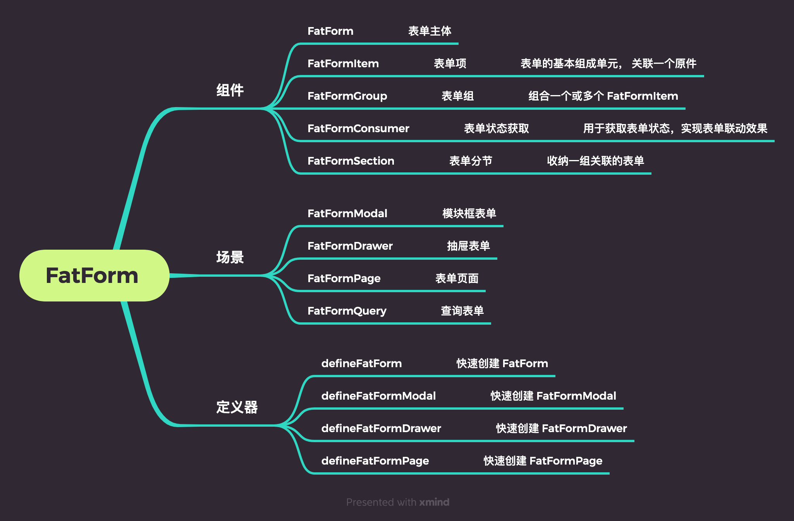
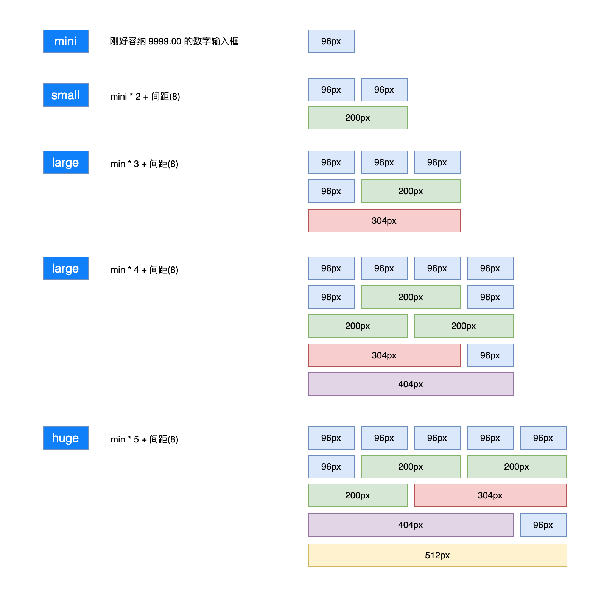

<script setup>
  import Layout from './Layout.vue'
  import HozGroup from './HozGroup.vue'
  import VerGroup from './VerGroup.vue'
  import MixGroup from './MixGroup.vue'
  import Width from './Width.vue'
  import Grid from './Grid.vue'
  import UniGrid from './UniGrid.vue'
  import Message from './Message.vue'
  import Section from './Section.vue'
  import InitialValue from './InitialValue.vue'
  import FatFormItemInitialValue from './FatFormItemInitialValue.vue'
  import InitialValueSync from './InitialValueSync.vue'
  import Request from './Request.vue'
  import Convert from './Convert.vue'
  import FatFormItemProp from './FatFormItemProp.vue'
  import Consumer from './Consumer.vue'
</script>

# 表单

FatForm 在 el-form 的基础之上进行了增强，配合原件，我们只需少量的配置就可以完成表单的开发。

以下是 FatForm 相关的套件：



<br>
<br>
<br>

[[toc]]

<br>
<br>
<br>

## 1. 表单布局

FatForm 支持 3 种典型的布局：

<ClientOnly>
<div class="wk-demo"><Layout /></div>
</ClientOnly>

::: details 查看代码
<<< @/fat-form/Layout.vue
:::

<br>
<br>

### 1.1 分组

使用 `FatFormGroup` 可以对灵活地组合表单项， 让布局更加简单。

<br>
<br>

**水平组合**:

<ClientOnly>
  <div class="wk-demo"><HozGroup /></div>
</ClientOnly>

::: details 查看代码
<<< @/fat-form/HozGroup.vue
:::

<br>
<br>

**垂直组合**:

<ClientOnly>
  <div class="wk-demo"><VerGroup /></div>
</ClientOnly>

::: details 查看代码
<<< @/fat-form/VerGroup.vue
:::

<br>
<br>

**混编**:

<ClientOnly>
  <div class="wk-demo"><MixGroup /></div>
</ClientOnly>

::: details 查看代码
<<< @/fat-form/MixGroup.vue
:::

<br>
<br>
<br>

### 1.2 预定义宽度

我们预定义了一些表单项宽度，可以满足大多数表单场景，实现快捷开发的同时，保证 UI 的一致性：

<br>



<br>
<br>

- `mini`=104px 适用于短数字、短文本或选项。
- `small`=216px 适用于较短字段录入、如姓名、电话、ID 等。
- `medium`=328px 标准宽度，适用于大部分字段长度。
- `large`=440px 适用于较长字段录入，如长网址、标签组、文件路径等。
- `huge`=552px 适用于长文本录入，如长链接、描述、备注等，通常搭配自适应多行输入框或定高文本域使用。

<br>

示例：

<ClientOnly>
  <div class="wk-demo">
    <Width />
  </div>
</ClientOnly>

::: details 查看代码
<<< @/fat-form/Width.vue
:::

<br>
<br>
<br>

### 1.3 网格布局

大部分场景我们推荐使用 FatFormGroup + width 来进行布局。 当然传统的网格布局我们依旧支持

<ClientOnly>
  <div class="wk-demo">
    <Grid />
  </div>
</ClientOnly>

::: details 查看代码
<<< @/fat-form/Grid.vue
:::

<br>

`FatFormGroup` 在这里的作用就是充当 [Row](https://element-plus.gitee.io/zh-CN/component/layout.html#row-%E5%B1%9E%E6%80%A7), 如果要进一步控制 row 的行为，可以通过 `FatFormGroup`#row 属性进行配置。

<br>

`FatFormGroup`、`FatFormItem` 都可以作为网格的单元格，通过 `col` 来配置单元格。

<br>

::: tip
`FatFormGroup` 会自动检测子节点是否开启了网格，默认情况使用 FatSpace 来分组布局。
:::

<br>
<br>
<br>
<br>

### 1.4 固定网格

某些场景，我们可能想要让所有的字段统一使用一个单元格配置，比如查询表单。这种情况可以使用 `FatForm` 的 col 属性来配置：

<br>

<ClientOnly>
  <div class="wk-demo">
    <UniGrid />
  </div>
</ClientOnly>

::: details 查看代码
<<< @/fat-form/UniGrid.vue
:::

<br>
<br>
<br>

### 1.5 提示信息

FatForm 内置了提示信息

<br>

<ClientOnly>
  <div class="wk-demo">
    <Message />
  </div>
</ClientOnly>

::: details 查看代码
<<< @/fat-form/Message.vue
:::

<br>
<br>
<br>
<br>

### 1.6 分类

复杂的表单会包含很多字段，适当分类用户体验会更加好:

<br>

<ClientOnly>
  <div class="wk-demo">
    <Section />
  </div>
</ClientOnly>

::: details 查看代码
<<< @/fat-form/Section.vue
:::

<br>
<br>
<br>
<br>

## 2. 表单数据

FatForm 会在内部维护表单的数据，用户有三种方式来设置表单的`初始值`:

- 通过 `initialValue`
- 通过 `request` 方法远程请求
- 通过 `FatFormItem` 的 `initialValue` 配置

如果没配置初始值，FatForm 会自动初始化。

<br/>

### 2.1 通过 initialValue 传入初始值

<br>
<br>

<ClientOnly>
  <div class="wk-demo">
    <InitialValue />
  </div>
</ClientOnly>

::: details 查看代码
<<< @/fat-form/InitialValue.vue
:::

<br>
<br>

默认情况下, 在 FatForm 启动时，initialValue 会进行一次*深拷贝*，然后作为表单的初始化状态。

如果你想要将表单变更的状态回写到 initialValue，可以开启 `syncToInitialValues` 选项：

<ClientOnly>
  <div class="wk-demo">
    <InitialValueSync />
  </div>
</ClientOnly>

::: details 查看代码
<<< @/fat-form/InitialValueSync.vue
:::

<br>
<br>
<br>

在 `FatFormItem` 上也可以设置初始化值，这种方式会更加灵活，尤其是在 [动态表单](#4-动态表单) 的场景：

<ClientOnly>
  <div class="wk-demo">
    <FatFormItemInitialValue />
  </div>
</ClientOnly>

::: details 查看代码
<<< @/fat-form/FatFormItemInitialValue.vue
:::

<br>
<br>
<br>
<br>

### 2.2 通过 request 远程请求数据

很多场景我们是从远程服务器拉取数据来编辑的，这种情况可以使用 request 方法：

<br>

<ClientOnly>
  <div class="wk-demo">
    <Request />
  </div>
</ClientOnly>

::: details 查看代码
<<< @/fat-form/Request.vue
:::

<br>
<br>

从远程返回的数据未必符合要求。比如时间区间，后端通常会拆成两个字段，而我们的组件用一个字段。另外一种场景是数据格式的转换。

- 这两者都可以在 request 中处理。
- 如果是纯粹的数据转换，也可以通过 FatFormItem 的 convert 属性来处理

<br>

使用示例：

<ClientOnly>
  <div class="wk-demo">
    <Convert />
  </div>
</ClientOnly>

::: details 查看代码
<<< @/fat-form/Convert.vue
:::

<br>
<br>
<br>
<br>

### 2.3 表单项

FatForm 并没有提供直接修改表单数据的手段，比如 el-form 官方使用 `v-model` 来修改状态：

```html
<el-form :inline="true" :model="formInline" class="demo-form-inline">
  <el-form-item label="审批人">
    <el-input v-model="formInline.user" placeholder="审批人"></el-input>
  </el-form-item>
  <el-form-item label="活动区域">
    <el-select v-model="formInline.region" placeholder="活动区域">
      <el-option label="区域一" value="shanghai"></el-option>
      <el-option label="区域二" value="beijing"></el-option>
    </el-select>
  </el-form-item>
  <el-form-item>
    <el-button type="primary" @click="onSubmit">查询</el-button>
  </el-form-item>
</el-form>
```

<br>
<br>

而 FatForm 下统一使用 FatFormItem 的 `prop` 来定义字段的路径：

<ClientOnly>
  <div class="wk-demo">
    <FatFormItemProp />
  </div>
</ClientOnly>

::: details 查看代码
<<< @/fat-form/FatFormItemProp.vue
:::

<br>

prop 是一个[查询路径](https://lodash.com/docs/4.17.15#get), 和 JavaScript 的对象成员语法一致, 格式示例：

```shell
a.b.c
a.b[0]    # 数组
a.b[0].c  # 数组
```

<br>
<br>
<br>
<br>

### 2.4 表单联动

复杂的表单绕不开表单之间的联动。 在 FatForm 中，我们推荐使用 `FatFormConsumer` 组件来实现联动：

<ClientOnly>
  <div class="wk-demo">
    <Consumer />
  </div>
</ClientOnly>

::: details 查看代码
<<< @/fat-form/Consumer.vue
:::

<br>

::: tip
如上面的代码所示，如果 FatFormItem 没有配置 label，如果想要和其他 FatFormItem 对齐，需要显式配置 `labelWidth` 为 `auto`
:::

<br>
<br>
<br>
<br>

## 3. 表单提交

下面介绍

### 3.1 表单验证

### 3.2 表单数据转换

### 3.3 表单提交

<br>
<br>
<br>
<br>

## 4. 动态表单

## 5. 预览模式

<br>
<br>
<br>
<br>

## 6. API

可继承的表单控制项
