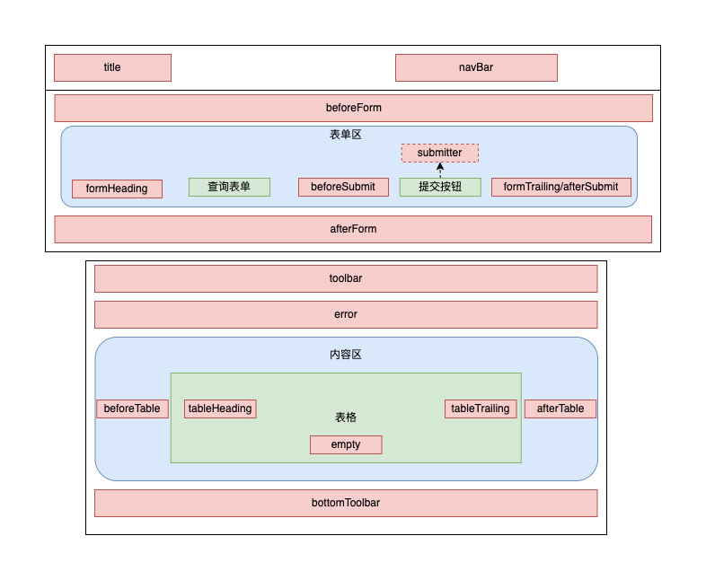
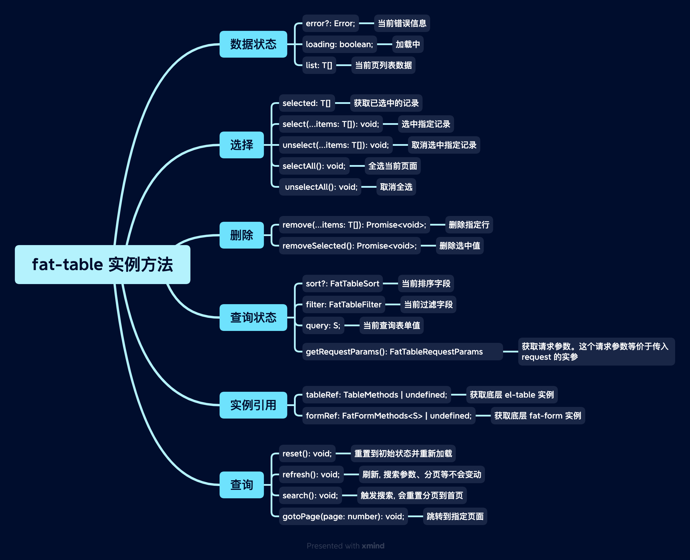
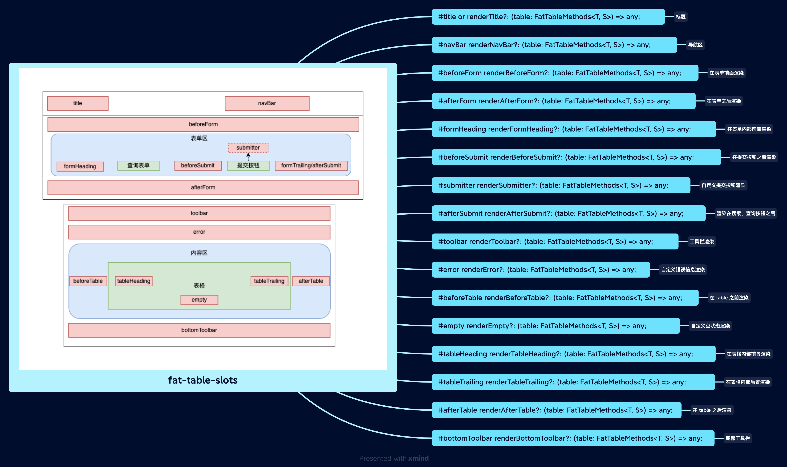
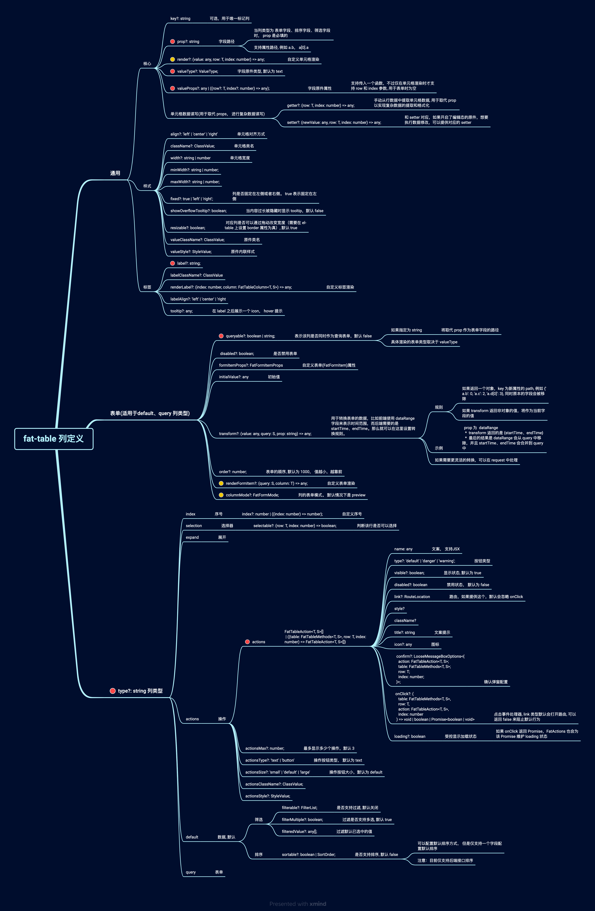

# Fat Table

`FatTable` 用于快速创建一个表格页面。

<br>

[[toc]]

<br>
<br>
<br>

## 1. 快速创建一个表格页面

<br>
<br>

<iframe class="demo-frame" style="height: 800px" src="./quick.demo.html" />

::: details 查看代码

<<< @/fat-table/Quick.tsx

:::

<br>
<br>
<br>

## 2. defineFatTable（推荐）

我们推荐使用 `defineFatTable` + `TSX` 来快速定义一个表格组件，使用 defineFatTable 可以获取到更好的智能提示和类型检查。

<br>
<br>

`defineFatTable` 大致用法如下：

```tsx
interface T {
  // 列表项类型声明
}

interface Q {
  // 表单查询类型声明
}

export const MyTable = defineFatTable<T, Q>(({ table, column }) => {
  // 和 vue 的 setup 方法一样, 这里可以放置 Vue Composition API
  const someRef = ref(0);
  const someMethod = () => {};

  // 返回 FatTable props
  return () => ({
    // 列表请求
    async request(params) {
      // ...
    },
    // 列定义
    columns: [
      // ...
    ],
    // ... 其他 FatTable props
  });
});
```

defineFatTable 类似于 Vue 的 [defineComponent](https://vuejs.org/api/general.html#definecomponent), 支持放置 Vue Hooks，只不过要求返回的是 FatTable 的 props 定义。

<br>

同样的功能使用 template 来写, 会丢失上下文信息(vue 组件不支持[`泛型`](https://www.typescriptlang.org/docs/handbook/2/generics.html#handbook-content))：

```vue
<template>
  <FatTable :request="request" :columns="columns" ref="tableRef"> </FatTable>
</template>

<script setup>
  import { ref } from 'vue';
  import { FatTable, useFatTableRef } from '@wakeadmin/components';
  const someRef = ref(0);
  const someMethod = () => {};

  const tableRef = useFatTableRef();

  const request = async () => {
    // ...
  };

  const columns = [
    /* ... */
  ];
</script>
```

<br>
<br>

显然 defineFatTable 可以让你更关注 FatTable 本身的配置。

<br>
<br>
<br>

## 3. 原件

[原件](../atomics/index.md)是 FatTable 的’原子‘组成单位，表格的单元格、查询表单都使用原件进行声明。

我们的组件库针对常用的场景内置了很多[原件](../atomics/index.md)，如果这些原件不能满足你的需求，我们也支持传入[自定义原件](../atomics/custom.md)。

<br>
<br>

单元格中默认使用的是原件的`预览形态`, 而查询表单中使用的是`编辑形态`。 以下是部分原件的使用示例:

<iframe class="demo-frame" style="height: 400px" src="./atomics.demo.html" />

::: details 查看代码

<<< @/fat-table/Atomics.tsx

:::

<br>
<br>
<br>

## 4. 表单查询

大部分场景下，`查询表单字段`和`表格列`是匹配的，换句话说，表单筛选是针对表格的列进行的：


<br>

基于这个前提，我们可以利用原件的`预览态`和`编辑态` 来快速开发表单页面。比如上图，columns 代码如下：

```tsx
[
  column({ prop: 'name', name: '旅程名称', queryable: true }), // 🔴 queryable 表示该列同时作为查询字段
  column({ prop: 'enterUserNumber', name: '进入人数' }),
  column({ prop: 'enterNumber', name: '进入次数' }),
  column({
    prop: 'type',
    name: '旅程类型',
    valueType: 'select',
    valueProps: { options: [{ label: '实时触发', value: 0 } /*...*/] },
    order: 100, // 🔴  可以使用 order 调整查询表单的顺序，默认为 1000， 值越小，越靠前
  }),
  column({
    prop: 'status',
    name: '旅程状态',
    valueType: 'select',
    valueProps: { options: [{ label: '草稿', value: 0, color: 'red' } /*...*/] },
  }),
  column({
    prop: 'updateTime',
    name: '更新时间',
  }),
  column({
    prop: 'createTime',
    name: '创建时间',
    valueType: 'date-time-range',
    valueProps: {
      valueFormat: 'YYYY-MM-DD HH:mm:ss',
    },
  }),
  column({
    type: 'actions',
    actions: [
      /*...*/
    ],
  }),
  column({
    type: 'query', // 🔴  只作为查询表单，不作为表格列
    valueType: 'checkbox',
    valueProps: {
      label: '预警旅程',
    },
  }),
];
```

<br>
<br>
<br>

## 5. 操作按钮

FatTable 中通过 actions 来定义表格的操作:

<br>

<iframe class="demo-frame" style="height: 300px" src="./actions.demo.html" />

::: details 查看代码

<<< @/fat-table/Actions.tsx

:::

<br>
<br>
<br>

## 6. 批量操作按钮

和操作按钮类似， FatTable 也支持快速创建批量操作按钮:

<br>

<iframe class="demo-frame" style="height: 720px" src="./batch-actions.demo.html" />

::: details 查看代码

<<< @/fat-table/BatchActions.tsx

:::

<br>
<br>
<br>

## 7. 插槽

<br>

FatTable 提供了丰富的插槽，用于满足复杂的自定义需求：



<br>

上图，红色矩形部分为 FatTable 提供的插槽。 插槽渲染有两种使用方式：

1. **在 Vue template 里面使用**, 例如

```vue
<template>
  <FatTable>
    <template #toolbar>
      <el-button>删除</el-button>
    </template>
  </FatTable>
</template>
```

  <br>

2. **使用 `render*` 方法。使用 defineFatTable 时，用这种方式比较合适**：

```tsx
defineFatTable({
  renderToolbar() {
    return <ElButton>删除</ElButton>;
  },
});
```

<br>
<br>
<br>

## 8. 自定义布局

FatTable 默认使用惟客云 UI 规范的布局。你也可以自定义布局，布局协议如下：

```ts
export type FatTableLayout = (slots: {
  /**
   * 根节点属性
   */
  rootProps: { class?: ClassValue; style?: StyleValue; [key: string]: unknown };

  /**
   * 自定义布局参数
   */
  layoutProps: any;

  /**
   * 渲染标题栏
   */
  renderTitle?: () => any;

  /**
   * 渲染导航栏
   */
  renderNavBar?: () => any;

  /**
   * 渲染查询表单
   */
  renderQuery?: () => any;

  /**
   * 渲染错误提示
   */
  renderError?: () => any;

  /**
   * 渲染工具栏
   */
  renderToolbar?: () => any;

  /**
   * 渲染表格
   */
  renderTable?: () => any;

  /**
   * 渲染底部工具栏
   */
  renderBottomToolbar?: () => any;

  /**
   * 渲染分页
   */
  renderPagination?: () => any;
}) => VNodeChild;
```

<br>
<br>

默认实现：

```tsx
const DefaultLayout: FatTableLayout = props => {
  return (
    <div {...props.rootProps} class={normalizeClassName(props.rootProps.class, 'fat-table', 'fat-table--default')}>
      <FatHeader class="fat-table__header" v-slots={{ title: props.renderTitle, extra: props.renderNavBar }}>
        {props.renderQuery ? <div class="fat-table__query">{props.renderQuery()}</div> : undefined}
      </FatHeader>

      <FatContent class="fat-table__content">
        <div class="fat-table__body">
          {!!props.renderError && <div class="fat-table__error">{props.renderError()}</div>}
          {!!props.renderToolbar && <div class="fat-table__toolbar">{props.renderToolbar()}</div>}

          <div class="fat-table__table">{props.renderTable?.()}</div>
        </div>

        <div class="fat-table__footer">
          {!!props.renderBottomToolbar && <div class="fat-table__bottom-toolbar">{props.renderBottomToolbar()}</div>}
          {!!props.renderPagination && <div class="fat-table__pagination">{props.renderPagination()}</div>}
        </div>
      </FatContent>
    </div>
  );
};
```

<br>

::: tip
当插槽不存在时会传入 `undefined`，你可以根据这个决定要不要渲染包裹器
:::

<br>

::: tip

可以配合 [`FatConfigurableProvider`](../fat-configurable/index.md) 实现全局配置。

:::

<br>
<br>
<br>
<br>

## 9. API

### 9.1 FatTable 属性


<br>
<br>
<br>
<br>

### 9.2 FatTable 事件


<br>
<br>
<br>

### 9.3 FatTable 实例方法



<br>

`FatTable` 实例方式获取有两种方式：

1. `defineFatTable` 函数参数 table 属性中获取：

   ```ts
   defineFatTable(({ table }) => {});
   ```

  <br>

2. `<template>` 中，使用 `useFatTableRef`:

   ```vue
   <template>
     <FatTable ref="tableRef">...</FatTable>
   </template>

   <script setup lang="tsx">
     import { FatTable, useFatTableRef } from '@wakeadmin/components';

     const tableRef = useFatTableRef();
   </script>
   ```

<br>
<br>
<br>

### 9.4 FatTable 插槽



<br>
<br>
<br>

### 9.5 列定义



<br>
<br>
<br>
